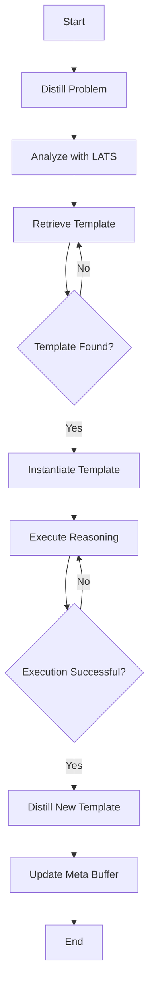

# Project Overview

This project integrates two powerful frameworks: [Buffer of Thoughts (BoT)](https://github.com/YangLing0818/buffer-of-thought-llm) and [LATS](https://github.com/langchain-ai/langgraph/blob/main/docs/docs/tutorials/lats/lats.ipynb). These frameworks enhance reasoning capabilities and logical analysis in large language models.

## Buffer of Thoughts (BoT)

BoT is a thought-augmented reasoning approach that improves the accuracy, efficiency, and robustness of large language models. It uses a meta-buffer to store high-level thought templates, which are retrieved and instantiated for specific tasks.

## LATS

LATS provides a logical analysis framework that can be integrated with language models to perform complex reasoning tasks. It is designed to work seamlessly with BoT to enhance problem-solving capabilities.

## High-Level Architecture

Below is a high-level representation of the system architecture using Mermaid:

## Key Classes

- **MetaBuffer**: Manages the storage and retrieval of thought templates.
- **ProblemDistiller**: Distills problems into structured graphs.
- **InstantiatedReasoner**: Instantiates and executes reasoning on thought templates.
- **LATSSubgraph**: Performs logical analysis tasks.

For more detailed information, please refer to the respective repositories linked above.
